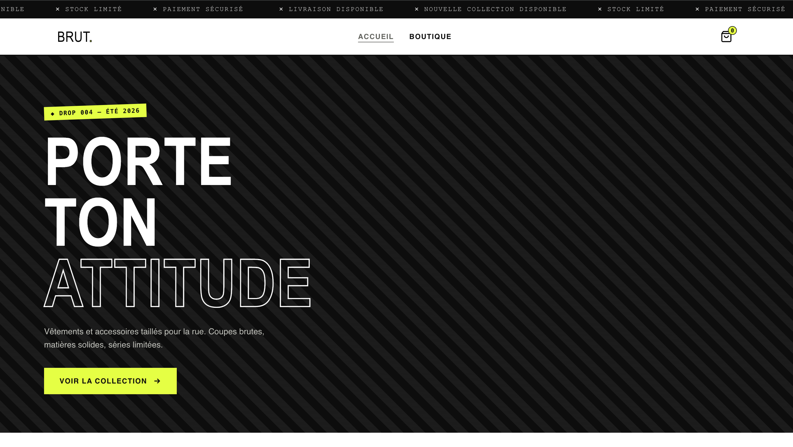

# BRUT — Streetwear E-commerce

BRUT is a streetwear e-commerce project focused on creating a modern and responsive online shopping experience.

The project explores the development of a clothing brand website with a clean interface, product presentation, and a foundation for future e-commerce features.

## Features

* Modern streetwear e-commerce interface
* Responsive design
* Product presentation
* Product categories
* Shopping cart
* Supabase integration
* Clean and user-friendly interface

## Technologies

* HTML
* CSS
* JavaScript
* Supabase

## Project Structure

The project is currently built in a single HTML file, including the main interface, styling, and JavaScript functionality.

```text
brut-streetwear/
└── index.html
```


## Project Preview



## Getting Started

Clone the repository:

```bash
git clone YOUR_REPOSITORY_URL
```

Open the project folder and launch the website locally.

## Author
## Live Demo

🔗 [Visit BRUT Streetwear](https://brut-streetwear.vercel.app/)


Mamadou Alpha Bah
